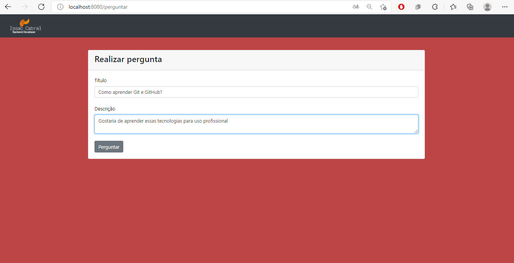

This is my first Backend project.

Technologies I used:
* Node Js
* Express
* ORM: Sequelize
* View Engine: ejs
* Postgres
* Bootstrap

ps: sorry for uploading the node modules folder xD, i forgot to configure gitignore

The project:  
It is a question and answer platform, in which you can register a question and for this you have one or several answers. All questions are listed from the bank and for each question you can see the answers or answer it  

<h2>Página Principal:</h2>

<h2>Formulário para criar pergunta:</h2>

<h2>Cadastrando uma pergunta:</h2>

<h2>Perceba que nossa pergunta foi listada</h2>

<h2>E agora vamos responder</h2>

*feel free to dig through the files, thank you so much*